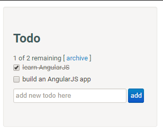

# 第2章 起步

- 搜索是什么
- 看官网能干什么
- 探索怎么用

---

## 安装

- Vue.js 不支持 IE8 及其以下版本
  + 因为 Vue 使用了 IE8 无法模拟的 ECMAScript 5 特性。但它支持所有兼容 ECMAScript 5 的浏览器。
- 最新稳定版本：2.6.10
  + 每个版本的更新日志见 [Github Releases](https://github.com/vuejs/vue/releases)
- 直接下载
  + 开发版本：`https://vuejs.org/js/vue.js`
  + 生产版本：`https://vuejs.org/js/vue.min.js`
- CDN
  - `<script src="https://cdn.jsdelivr.net/npm/vue"></script>` 最新稳定版
  - `<script src="https://cdn.jsdelivr.net/npm/vue@2.6.10/dist/vue.js"></script>` 指定版本
- 使用 `npm` 下载
  + `npm install vue` 最新稳定版
  + `npm install vue@版本号` 指定版本

---

## Hello World

```html
<!DOCTYPE html>
<html lang="en">
<head>
  <meta charset="UTF-8">
  <title>Hello World</title>
</head>
<body>
  <div id="app">
    <h1>{{ message }}</h1>
  </div>
  <script src="../node_modules/vue/dist/vue.js"></script>
  <script>
    new Vue({
      el: '#app',
      data: {
        message: 'Hello Vue.js!'
      }
    })
  </script>
</body>
</html>
```

---

## Vue 实例

- el
- data
- methods
- ...

## 文本绑定

- `{{data}}`

## 属性绑定

- `v-bind`

---

## 表单控件双向数据绑定

- `text`
- `textarea`
- `checkbox`
- `radio`
- `select`
- ...

---

## 条件渲染

- `v-if`

## 列表渲染

- `v-for`

---

## 事件处理

- `v-on`

---

## 课堂练习

以下是几个小练习，用来辅助大家增强体会 Vue 的数据驱动视图思想（MVVM）：

- 姓名展示：两个文本框，让用户分别输入性和名，然后将数据实时展示到界面上
- 数字自动增长：一个文本框用来呈递数字，一个按钮，用户点击按钮，文本框中的数字+1
- 购物车计价器：有商品价格，和商品数量，用户可以点击加减按钮改变商品数量，将价格实时展示到界面上
- 数字计算器：实现加法计算器
- 数字计算器：实现加减乘除

以上所有练习，都不要着急写代码，不要用以前 DOM 的思想去操作，
利用 Vue 的数据驱动视图的思想，去考虑问题：

- 根据视图抽象数据模型
  + 数据
  + 行为
- 数据改变，触发视图更新

---

## 综合案例：`Todo List`



- 任务列表展示
- 添加任务
- 切换任务完成状态
- 删除单个任务
- 删除所有已完成任务
- 显示所有任务数量
- 显示所有未完成任务数

---

## 使用总结

- Vue 最大程度上减少了页面上的 DOM 操作
- 让开发人员更专注于业务操作
- 通过简洁的指令结合页面结构与逻辑数据
- 通过组件化方便模板重用以及增加可维护性
- 代码结构更合理
- 维护成本更低
- **VueJS 解放了传统 JavaScript 中频繁的 DOM 操作**
