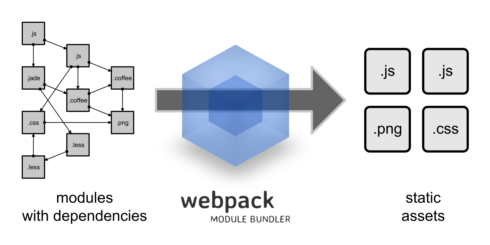

# 第12章 webpack


现今的很多网页其实可以看做是功能丰富的应用，它们拥有着复杂的JavaScript代码和一大堆依赖包。为了简化开发的复杂度，前端社区涌现出了很多好的实践方法

模块化，让我们可以把复杂的程序细化为小的文件;
类似于TypeScript这种在JavaScript基础上拓展的开发语言：使我们能够实现目前版本的JavaScript不能直接使用的特性，并且之后还能转换为JavaScript文件使浏览器可以识别；
Scss，less等CSS预处理器
...
这些改进确实大大的提高了我们的开发效率，但是利用它们开发的文件往往需要进行额外的处理才能让浏览器识别,而手动处理又是非常繁琐的，这就为 WebPack 类的工具的出现提供了需求。

## 介绍

### 是什么



- 打包工具
- JavaScript 模块打包之后就可以运行在浏览器
- 能做什么
  - webpack 可以当作是一个模块打包平台，但是它本身只能打包 JavaScript 模块
  - 对于其它的文件模块资源，则需要使用第三方 loader 来处理
  - JavaScript 资源打包
  - css 打包
  - 图片 打包
  - less
  - sass
  - babel EcmaScript 6 转 EcmaScript 5
  - 开发工具：http 服务器
  - 代码改变，自动刷新浏览器
  - 压缩代码
  - JavaScript 代码压缩
  - html 代码压缩
  - css  代码压缩
  - 。。。。

### 核心概念

- Entry
- Output
- Loaders
- Plugins
- Mode
- Browser Compatibility

### 其它打包工具

- [Grunt](https://github.com/gruntjs/grunt)
- [Gulp](https://github.com/gulpjs/gulp)
- [Rollup](https://github.com/rollup/rollup)
- [Browserify](https://github.com/browserify/browserify)
- [Parcel](https://github.com/parcel-bundler/parcel)
- [FIS](https://github.com/fex-team/fis3)
- ...

### 相关资源链接

- webpack 官网
  - [webpack 1.x](http://webpack.github.io/)
  - [webpack 2](https://webpack.js.org/)
- [官方教程](https://webpack.js.org/guides)
- [Github 仓库](https://github.com/webpack/webpack)
- [常用 Loaders 列表](https://webpack.js.org/loaders)
- [常用 Plugins 列表](https://webpack.js.org/plugins)


## 起步

### hello world

创建示例目录并安装依赖

```bash
mkdir webpack-demo && cd webpack-demo
npm init -y
npm install webpack webpack-cli --save-dev
```


- index.html
- src
  - index.js
  - foo.js


`foo.js` 文件内容如下：

```javascript
export default function () {
  console.log('我是 foo 文件模块啊')
}
```


`main.js` 文件内容如下：

```javascript
import foo from './foo'

foo()

```

打包：

```shell
npx webpack
```


index.html` 文件内容如下：

```html
<!DOCTYPE html>
<html lang="en">
<head>
  <meta charset="UTF-8">
  <title>Document</title>
</head>
<body>
  <!-- <script src="js/main.js"></script> -->
  <!-- 最后记得把 index.html 文件中的脚本应用改为打包之后的结果文件路径。 -->
  <script src="js/bundle.js"></script>
</body>
</html>
```

打开查看 index.html。


### 安装

我们安装的时候把 webpack 安装到开发依赖(--save-dev)中，因为 webpack 只是一个打包工具，项目如果需要上线，上线的是打包的结果，而不是这个工具。所以了我们为了区分核心包依赖和开发工具依赖，这里通过 `--save` 和 `--save-dev` 来区分。


本地安装（推荐）：

```shell
# 把工具（webpack、style-loader、less-loader...）相关的依赖项保存到开发依赖
# 把非工具（vue、axios、vue-router、moment...）正常安装
npm install --save-dev webpack
```

对于安装到项目中的 webpack 需要配置 npm scripts 来使用：

```json
{
  "name": "demo2",
  "version": "1.0.0",
  "description": "",
  "main": "webpack.config.js",
  "scripts": {
    "build": "webpack"
  },
  "keywords": [],
  "author": "",
  "license": "ISC",
  "devDependencies": {
    "webpack": "^3.8.1"
  }
}

```

然后通过 `npm run` 命令来打包：

```shell
npm run a

# start 比较特殊，可以不加 run
npm start

# 打包构建
# 这里使用的 webpack 就是项目中安装的 webpack
npm run build
```

### 配置文件 `webpack.config.js`

最基本的配置项：

```javascript
// 该文件其实最终是要在 Node 环境下执行的
const path = require('path')

// 导出一个具有特殊属性配置的对象
module.exports = {
  entry: './src/main.js', // 入口文件模块路径
  output: {
    path: path.join(__dirname, './dist/'), // 出口文件模块所属目录，path 必须是一个绝对路径
    filename: 'bundle.js' // 打包的结果文件名称
  }
}
```

打包：

```shell
# webpack 会自动读取 webpack.config.js 文件作为默认的配置文件
# 也可以通过 --config 参数来手动指定配置文件
webpack
```

### npm scripts


## 打包 JavaScript 模块

> https://webpack.js.org/concepts/modules

### JavaScript 模块化

- AMD
  - Require.js
- CMD
  - Sea.js
- CommonJS 模块规范
- 以上都是民间搞出来的，所以在 2015 年的 EcmaScript 6 中官方就发布了官方的 模块规范：EcmaScript 6 Module 模块规范
  - 我们更推荐在项目中使用 EcmaScript 6 模块规范
  - 以后的统一趋势
- webpack
  - AMD
  - CMD
  - CommonJS
  - EcmaScript 6 Module


### EcmaScript 6 模块规范

导入 import（require）

导出 export（module.exports）

导出默认成员：

```javascript
// 默认成员只能有一个，否则报错
exports default 成员
```

加载默认成员：

```javascript
// 如果没有 default 成员，则加载到的就是 undefined
import xxx from '模块标识'
```

导出多个成员：

```javascript
// export 必须引用到内部的一个成员
export const a = 123
export const b = 456
export function fn () {
  console.log('fn')
}
```

如果你觉得上面的方式比较麻烦，也可以以这样的方式来导出多个成员：

```javascript
const a = 123
const b = 456
function fn () {
  console.log('fn')
}

// 注意：这里不是对象的简写方式，这是导出的特殊语法
// 这种方式也不是覆盖，后面还可以继续导出
export {
  a,
  b,
  fn
}

// 可以继续增加导出的成员
export function add (x, y) {
  return x + y
}

// 最终导出的实际上是 a、b、fn、add
```


按需加载指定的多个成员：

```javascript
import {a, b} from '模块标识'
```

一次性加载所有的导出成员：

```javascript
// 所有成员包含 default
import * as xxx from '模块标识'
```


## 打包其它资源

webpack 不仅可以打包 JavaScript 模块，甚至它把网页开发中的一切资源都可以当作模块来打包处理。

按时它本身不知此，它只是一个打包平台，其它资源，例如 css、less、sass、img 等资源需要结合插件来实现，这些插件在 webpack 中被称之为 loader ，翻译过来就是 加载器 的意思。

### 打包 CSS 样式文件

> - https://webpack.js.org/loaders/css-loader
> - https://webpack.js.org/loaders/style-loader

安装依赖：

```shell
# CSS-loader 的作用是吧 CSS 文件转为 JavaScript 模块
# style-loader 的作用是动态创建 style 节点插入到 head 中
npm install --save-dev style-loader css-loader
```

配置：

```json
var path = require('path')

module.exports = {
  entry: './src/main.js',
  output: {
    path: path.join(__dirname, './dist/'), // 这里必须是绝对路径
    filename: 'bundle.js'
  },
  module: {
    rules: [
      {
        test: /.css$/,
        use: [
          // 注意：这里的顺序很重要，不要乱了顺序，从咱们的角度，老外的思维是反的
          'style-loader',
          'css-loader'
        ]
      }
    ]
  }
}

```

打包：

```shell
npm run build
```

解释：打包 css 也是把 CSS 文件内容转换成了一个 JavaScript 模块，然后在运行 JavaScript 的时候，会动态的创建一个 style 节点插入到 head 头部。

### 打包图片文件

#### file-loader

> https://webpack.js.org/loaders/file-loader

#### image-webpack-loader

> https://github.com/tcoopman/image-webpack-loader

#### url-loader

> https://webpack.js.org/loaders/url-loader/

安装依赖：

```shell
npm install --save-dev file-loader
```

配置：

```javascript
module: {
  rules: [
    {
      test: /.css$/,
      use: [
        'style-loader',
        'css-loader'
      ]
    },
    {
      test: /.(jpg|png|gif|svg)$/,
      use: [
        'file-loader'
      ]
    }
  ]
}
```

### 打包字体文件

- file-loader

### 打包 Less 样式文件

> https://webpack.js.org/loaders/less-loader

安装依赖：

```shell
# 如果 css-loader 安装过了就不需要安装了
npm i -D css-loader style-loader less less-loader
```

配置：

```javascript
module: {
  rules: [
    {
      test: /.less$/,
      use: [
        'style-loader', // 3. 根据模块生成 style 节点插入 head 中
        'css-loader', // 2. 在把 css 转成 JavaScript 模块
        'less-loader' // 1. 先把 less 转成 css
      ]
    }
  ]
}
```


### 打包 Sass 样式文件

- https://webpack.js.org/loaders/sass-loader

### 打包 ES6 转换 ES5

> https://webpack.js.org/loaders/babel-loader

- babel
  - http://babeljs.io/
  - babel 是一个 JavaScript 编译器，可以把 EcmaScript 6 编译成 EcmaScript 5
  - babel 可以独立使用，但是独立使用没有意义，一般是和 webpack 结合到一起来使用的
- cacheDirectory
- babel-polyfill
  - 默认 babel 只转换语法
  - 我们可以使用 babel-polyfill 来转换 EcmaScript 6 中的 API
- babel runtime

安装依赖：

```shell
npm install --save-dev babel-loader babel-core babel-preset-env
```

配置：

```javascript
module: {
  rules: [
    {
      test: /\.js$/,
      exclude: /(node_modules|bower_components)/, // 不转换 node_modules 中的文件模块
      use: {
        loader: 'babel-loader',
        options: {
          presets: ['env']
        }
      }
    }
  ]
}
```

> babel 只转换 ECMAScript 6 语法
>
> let、const、箭头函数、解构赋值
>
> 不会转换 API，例如数组的 find、findIndex、字符串的 startsWith、endsWith

#### 配置 babel-polyfill 来提供低版本浏览器中的不支持 API

- entry 入口加载 babel-polyfill
- .babelrc
  - useBuiltIns: 'usage'
- 入口文件 import babel-polyfill

安装：

```shell
npm i -D babel-polyfill
```

配置：

```javascript
entry: ['babel-polyfill', './src/main.js'],
```

这样话就会在打包的结果中提供一个垫脚片用以兼容低版本浏览器中的不支持的 API。


#### 配置 transform-runtime 来解决代码重复问题

在打包过程中，babel 会在某个包提供一些工具函数，而这些工具函数可能会重复的出现在多个模块。这样的话就会导报打包体积过大，所以 babel 提供了一个 babel-transform-runtime 来解决这个打包体积过大的问题。


安装：

```shell
npm install babel-plugin-transform-runtime --save-dev
npm install babel-runtime --save
```

配置：

```javascript
module: {
  rules: [
    {
      test: /\.js$/,
      exclude: /(node_modules|bower_components)/,
      use: {
        loader: 'babel-loader',
        options: {
          presets: ['env'],
          plugins: ['transform-runtime']
        }
      }
    }
  ]
}
```

#### 加入缓存节省编译时间

babel 编译是非常耗时的，我们可以通过开启对编译结果的缓存来提高打包速度：

```javascript
module: {
  rules: [
    {
      test: /\.js$/,
      exclude: /(node_modules|bower_components)/,
      use: {
        loader: 'babel-loader',
        options: {
          // 默认把打包的结果缓存到 node_modules/.cache 模板
          cacheDirectory: true,
          presets: ['env'],
          plugins: ['transform-runtime']
        }
      }
    },
  ]
}
```

## 管理输出

### 打包 HTML 文件

> https://webpack.js.org/plugins/html-webpack-plugin

你会发现，当你打包结束的时候，如果 index.html 在根目录直接运行的话，那么图片资源这些路径就无法访问到了。解决方案就是把 index.html 放到 dist 目录中。

但是 dist  是打包编译的结果，而非源码，所以把 index.html 放到 dist 就不合适。

而且你也会发现，我们打包的结果文件名：`bundle.js` ，如果一旦我把这个文件名给改了，则 index.html 也要手动修改。

综合以上我们遇到的问题，我们就可以使用一个插件：`html-webpack-plugin` 来解决。


安装依赖：

```shell
npm i -D html-webpack-plugin
```

配置：

```javascript
plugins: [
  // 该插件的所用就是把 index.html 打包到你的 bundle.js 文件所属目录
  // 也就是说 bundle 到哪里，index.html 就到哪里
  // 同时这个也会自动在 index.html 中出入 script 引用连接
  // 而且引用的资源名称，也取决于你的 bundle 叫什么
  // 这个插件还可以配置压缩 html 的处理
  new htmlWebpackPlugin({
    template: './index.html'
  })
],
```


### 清理 dist 目录

> https://github.com/johnagan/clean-webpack-plugin

## 开发环境

### 配置 mode

> 作用：打包模式
>
> 参考文档：https://webpack.js.org/configuration/mode

| Option        | Description                                |
| :------------ | :----------------------------------------- |
| `development` | 开发模式，更快的构建速度，建议开发构建使用 |
| `production`  | 生产模式，更好的构建结果，建议生产构建使用 |
| `none`        | 默认优化选项                               |

如果未设置，则webpack将production设置为mode的默认值。

### 配置 Source Map

当 webpack 打包源代码时，可能会很难追踪到 error(错误) 和 warning(警告) 在源代码中的原始位置。例如，如果将三个源文件（`a.js`, `b.js` 和 `c.js`）打包到一个 bundle（`bundle.js`）中，而其中一个源文件包含一个错误，那么堆栈跟踪就会直接指向到 `bundle.js`。你可能需要准确地知道错误来自于哪个源文件，所以这种提示这通常不会提供太多帮助。

为了更容易地追踪 error 和 warning，JavaScript 提供了 [source map](http://blog.teamtreehouse.com/introduction-source-maps) 功能，可以将编译后的代码映射回原始源代码。如果一个错误来自于 `b.js`，source map 就会明确的告诉你。


扩展阅读：

- [JavaScript Source Map 详解](http://www.ruanyifeng.com/blog/2013/01/javascript_source_map.html)
- [An Introduction to Source Maps](https://blog.teamtreehouse.com/introduction-source-maps)
  - [译文](https://juejin.im/post/5bd65e1ae51d457aa071feaa)

### 使用 watch 监视模式

```json
  {
    "name": "development",
    "version": "1.0.0",
    "description": "",
    "main": "webpack.config.js",
    "scripts": {
      "test": "echo \"Error: no test specified\" && exit 1",
+     "watch": "webpack --watch",
      "build": "webpack"
    },
    "keywords": [],
    "author": "",
    "license": "ISC",
    "devDependencies": {
      "clean-webpack-plugin": "^2.0.0",
      "css-loader": "^0.28.4",
      "csv-loader": "^2.1.1",
      "file-loader": "^0.11.2",
      "html-webpack-plugin": "^2.29.0",
      "style-loader": "^0.18.2",
      "webpack": "^3.0.0",
      "xml-loader": "^1.2.1"
    }
  }
```

### 使用 webpack-dev-server

> https://webpack.js.org/configuration/dev-server/

- 安装依赖
- 配置
- 测试

每一次手动打包很麻烦，而且即便有 `--watch` 也不方便，还需要自己手动刷新浏览器。

所以 webpack 给你提供了一个工具：`webpack-dev-server`

它就可以实现监视代码改变，自动打包，打包完毕自动刷新浏览器的功能。

安装：

```shell
npm i -D webpack-dev-server
```

配置：

```javascript
devServer: {
  // 配置 webpack-dev-server 的 www 目录
  contentBase: './dist'
},
```

配置 npm scritps:

```json
"scripts": {
  "build": "webpack",
  "watch-build": "webpack --watch",
  "dev": "webpack-dev-server --open"
},
```

启动开发模式：

```shell
npm run dev
```

解释：该工具会自动帮你打包，打包完毕只有会自动开启一个服务器，默认监听 8080 端口号，同时自动打开浏览器让你访问，接下来就会自动监视代码的改变，然后自动编译，编译完毕，自动刷新浏览器。

#### 配置跨域

> https://webpack.js.org/configuration/dev-server/

### 配置热更新

> https://webpack.js.org/guides/hot-module-replacement

```javascript
const path = require('path')
const htmlWebpackPlugin = require('html-webpack-plugin')
+++ const webpack = require('webpack')

module.exports = {
  entry: ['babel-polyfill', './src/main.js'],
  output: {
    path: path.join(__dirname, './dist/'), // 这里必须是绝对路径
    filename: 'bundle.js'
  },
  plugins: [
    // 该插件的所用就是把 index.html 打包到你的 bundle.js 文件所属目录
    // 也就是说 bundle 到哪里，index.html 就到哪里
    // 同时这个也会自动在 index.html 中出入 script 引用连接
    // 而且引用的资源名称，也取决于你的 bundle 叫什么
    // 这个插件还可以配置压缩 html 的处理
    new htmlWebpackPlugin({
      template: './index.html'
    }),
    +++ new webpack.NamedModulesPlugin(),
    +++ new webpack.HotModuleReplacementPlugin()
  ],
  devServer: {
    // 配置 webpack-dev-server 的 www 目录
    // 浏览器真正运行查看的是打包之后的结果
    // webpack-dev-server 为了提高打包效率，它把文件存储在了内存中，你看不见
    // 这里你只是在告诉 webpack-dev-server 让你的打包结果运行在虚拟目录 dist 中
    // 那这个时候你的打包结果中的 index.html 去加载资源时候确实需要相对于 dist 来找
    // ./ 的话，webpack-dev-server 就会直接把资源打包到项目根目录下
    // 但是注意：你也看不见它
    // 那这个时候你在 index.html 文件中请求的资源就是相对于 demo7 根目录
    contentBase: './',
    +++ hot: true
  },
  externals: {
    // key 就是包名
    // value 是全局的 jQuery 导出的接口
    vue: 'Vue'
  },
  module: {
    rules: [{
        test: /.css$/,
        use: [
          'style-loader',
          'css-loader'
        ]
      },
      {
        test: /.(jpg|png|gif|svg)$/,
        use: [
          'file-loader'
        ]
      },
      {
        test: /.less$/,
        use: [
          'style-loader', // 3. 根据模块生成 style 节点插入 head 中
          'css-loader', // 2. 在把 css 转成 JavaScript 模块
          'less-loader' // 1. 先把 less 转成 css，less-loader 依赖 less，所以 less 也要安装进来
        ]
      },
      {
        test: /\.js$/,
        exclude: /(node_modules|bower_components)/,
        use: {
          loader: 'babel-loader',
          options: {
            cacheDirectory: true,
            presets: ['env'],
            plugins: ['transform-runtime']
          }
        }
      },
      {
        test: /.vue$/,
        use: [
          'vue-loader'
        ]
      }
    ]
  }
}

```

### 配置 ESLint 代码规范校验

> https://webpack.js.org/loaders/eslint-loader

## webpack 高级概念

### Tree Shaking

> https://webpack.js.org/guides/tree-shaking

- 基本概念
- Tree Shaking
- 只支持 ES6 模块

### 代码分割

### 懒加载

### 缓存

> https://webpack.js.org/guides/caching

#### 输出的文件名

#### 提取引导模板


## 区分打包环境

> https://webpack.js.org/guides/production

---

## 打包 .vue 文件

> https://vue-loader.vuejs.org/zh/

## Resolve

### alias

> 参考文档：
>
> 作用：配置别名，解决文件路径改变以及加载路径过深问题。

### extensions

## externals

> 配置 webpack 不打包第三方包

通常情况下我们不打包第三方包，因为第三方包太大，和 bundle 打包到一起会造成资源体积过大，所以我们还是通过 script 标签的方式把第三方资源引入到页面中，只需要通过以下配置即可，这里以 jQuery 为例：

1. 下载第三方包

```shell
npm i jquery
```

2. 在页面中引入资源

```html
<script src="node_modules/jquery/dist/jquery.js"></script>
```

3. 配置

```javascript
externals: {
  // key 是第三方包名称，value 是全局中的 jQuery 对象
  // 这里配置的含义就是：当你在代码中 import jquery 的时候，不会把 jquery 打包到 bundle 中，而是使用我指定的全局中的 jQuery 对象
  jquery: 'jQuery'
}
```

4. 加载使用

```javascript
import $ from 'jquery'

$('#app', {
  width: 200,
  height: 200,
  backgroundColor: 'pink'
})
```

5. 打包测试

```shell
npm run build
```

## `--save` 和 `--save-dev` 的区别

我们把开发工具相关的依赖信息保存到 `devDependencies` 选项中。把核心依赖（例如 vue）的依赖信息保存到 `dependencies` 选项中。

这样做的话，就是把开发依赖和核心依赖分开了，因为开发依赖在打包结束之后上线的话就不需要。

最后项目上线，我们真正需要安装发布的是 `dependencies` 依赖项中的包。

我们可以通过命令来只安装 `dependencies` 依赖项中的包：

```shell
npm install --production
```

## vue-webpack-starter

### 在模块化环境中使用 vue-router

1. 下载

```shell
npm i vue-router
```

2. 引用资源

```html
<script src="node_modules/vue-router/dist/vur-router.js"></script>
```

3. 配置 externals

```javascript
externals: {
  'vue-router': 'VueRouter'
}
```

4. 在 `router.js` 文件中加载使用

```javascript
import VueRouter from 'vue-router'
import Foo from './components/Foo.vue'
import Bar from './components/Bar.vue'

// 这里直接默认导出 new 出来的 router 实例
export default new VueRouter({
  routes: [
    {
      path: '/foo',
      component: Foo
    },
    {
      path: '/bar',
      component: Bar
    }
  ]
})

```

5. 在 `main.js` 文件中配置使用路由对象

```javascript
import Vue from 'vue'
import App from './App.vue'
+++ import router from './router'

new Vue({
  components: { App },
  template: '<App />',
  +++ router
}).$mount('#app')

```

6. 在 `App.vue` 中设置路由出口

```html
<template>
<div id="app">
  <h1>根组件 hh </h1>
  <ul>
    <li><a href="#/foo">Go to Foo</a></li>
    <li><a href="#/bar">Go to Bar</a></li>
  </ul>
  +++ <router-view></router-view>
</div>
</template>
```

## webpack 打包优化发布策略

>webpack 优化还是很有必要的


- 开发配置文件：`webpack.dev.conf.js`
- 发布配置文件：`webpack.prod.conf.js`
- 使用 url-loader 减少网站中图片资源的请求数量
  - 小图片直接 base64 内置到模板中
  - 大图片拷贝到结果目录中
  - 把图片资源分离到特定的目录中
- 使用 `clean-webpack-plugin` 清除 `dist` 目录
- 分离第三方包（解决 js 文件体积过大的问题）
  - 多入口
  - `webpack.optimize.CommonsChunkPlugin()`
- 压缩 html
  - 减小文件体积，提高加载速度
- 压缩 JavaScript
  - 减小文件体积，提高加载速度
  - `webpack.optimize.UglifyJsPlugin()`
  - `webpack.optimize.DedupePlugin()` 配置插件环境变量
  - 把 JavaScript 分离到指定的目录中
- 抽离 CSS 样式文件
  - 为了让浏览器尽快的优先加载样式，也是为了解决js 文件体积过大的问题
  - 把 css 分离到指定的目录结构中
  - extract-text-webpack-plugin
- 压缩抽取出来的 CSS 文件：https://github.com/webpack-contrib/css-loader#minimize
  - 压缩 CSS 也是为了减小文件题解，提高响应速度
