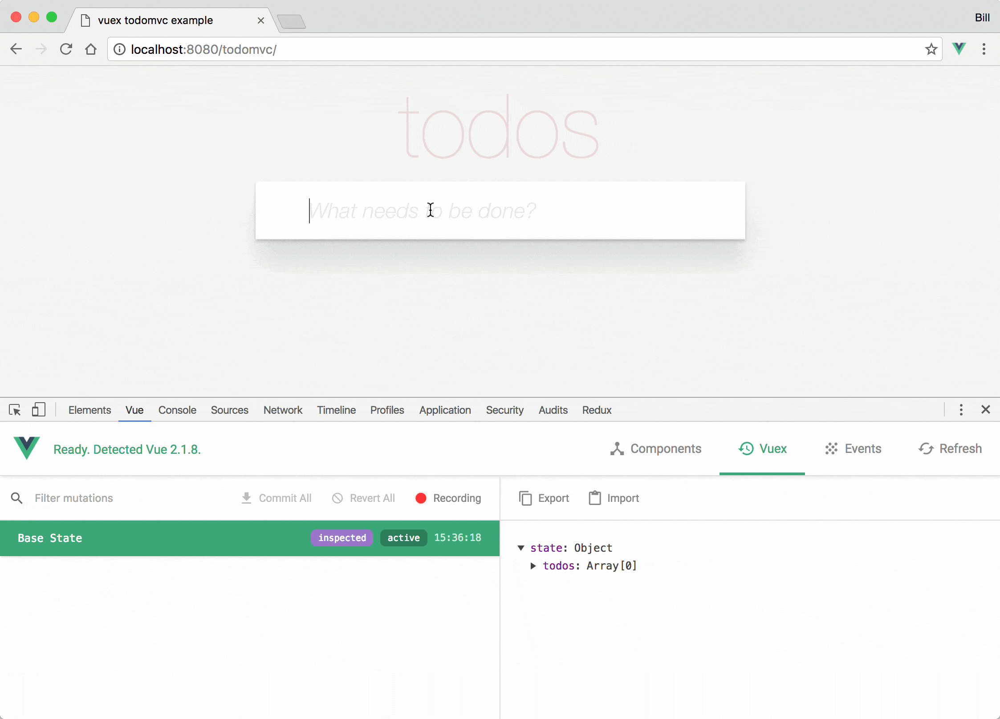

# 附录2 Vue 调试

## Vue Devtools

> 详见官方文档：[Devtools](https://github.com/vuejs/vue-devtools)

最流行和简单的是使用非常棒的 [Chrome 版本](https://chrome.google.com/webstore/detail/vuejs-devtools/nhdogjmejiglipccpnnnanhbledajbpd) 和 [Firefox 版本](https://addons.mozilla.org/en-US/firefox/addon/vue-js-devtools/)的 Vue.js devtools。使用 devtools 有很多好处，比如它可以让你能够实时编辑数据属性并立即看到其反映出来的变化。另一个主要的好处是能够为 Vuex 提供时间旅行式的调试体验。




## 在 VS Code 中调试

> 详见官方文档：[在 VS Code 中调试](https://cn.vuejs.org/v2/cookbook/debugging-in-vscode.html)

## 简单的 debugger 语句

你可以直接在代码中使用[原生的 `debugger` 语句](https://developer.mozilla.org/zh-CN/docs/Web/JavaScript/Reference/Statements/debugger)。如果你选择了这种方式，请千万记得当你调试完毕之后把这个语句移除。

```html
<script>
export default {
  data() {
    return {
      message: ''
    }
  },
  mounted() {
    const hello = 'Hello World!'
    debugger
    this.message = hello
  }
};
</script>
```